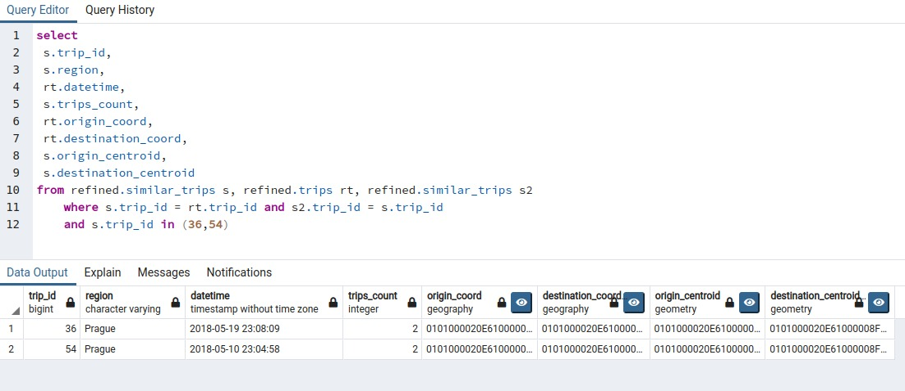
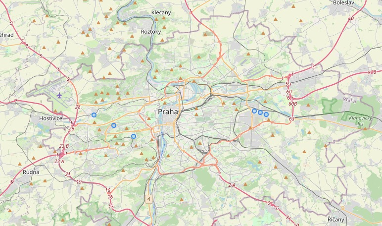
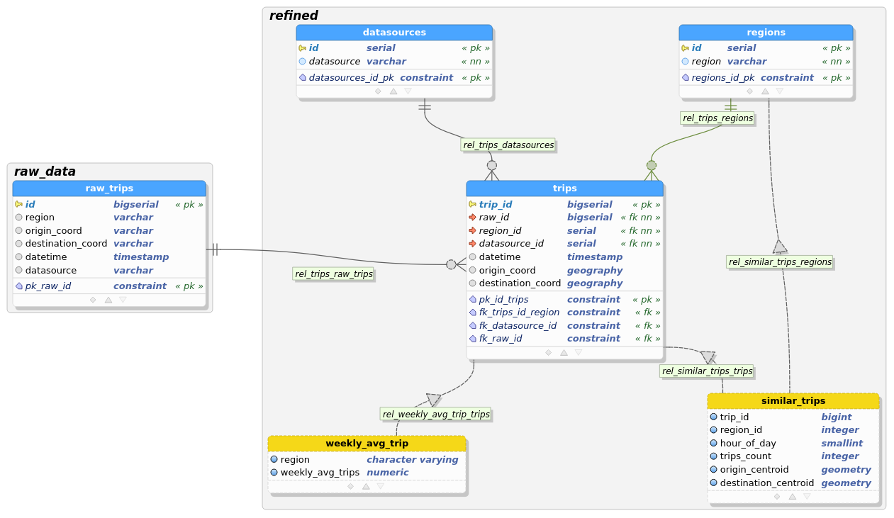
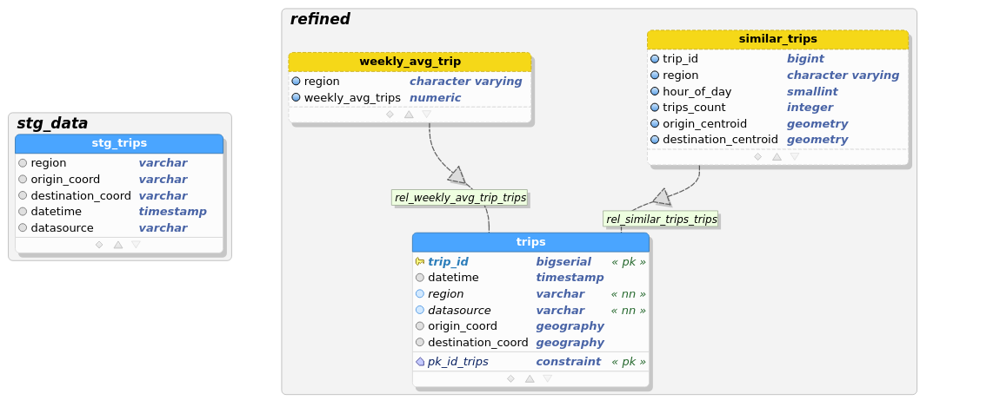
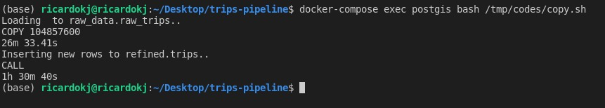
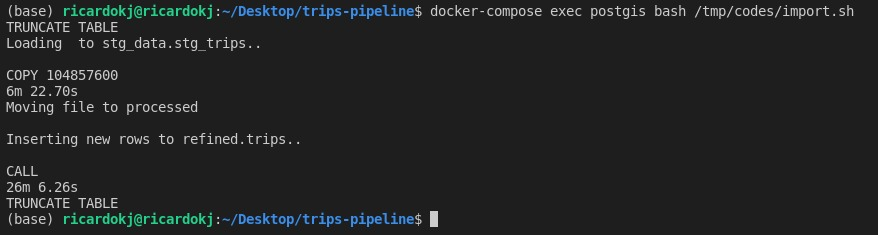
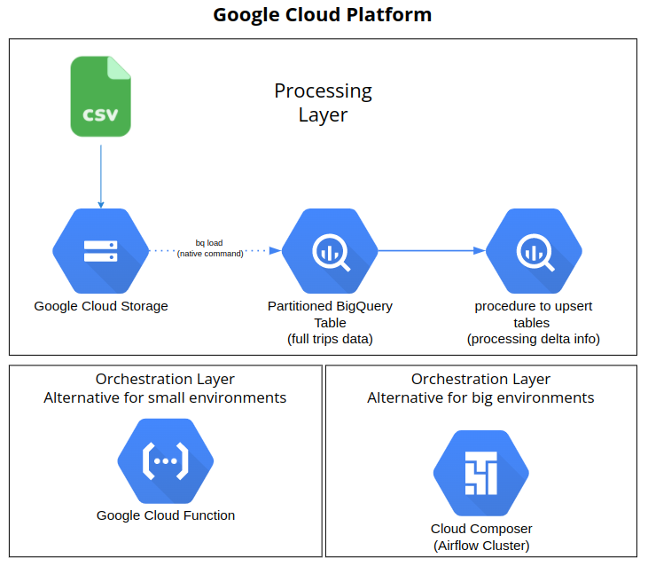

# Trips Pipeline Container
Container used to ingest CSV file to PostgreSQL environment.

## Getting Started

### Prerequisites


In order to run this container you'll need docker installed.

* [Windows](https://docs.docker.com/desktop/windows/)
* [OS X](https://docs.docker.com/desktop/mac/)
* [Linux](https://docs.docker.com/engine/install/)

Build and run these images locally:
* postgis:11-2.5-alpine
* dpage/pgadmin4

### Building and starting containerized environment
On project folder (./trips-pipeline): 
```shell
docker-compose up
```
#### Volumes

* `./codes/` - Code location
* `./input_file/` - File location

## Accessing pgAdmin4 (after docker environment building)
* http://localhost:16543
* Login on pgAdmin4 page: postgres@gmail.com
* Password on pgAdmin4 page: postgres
* Add a new server using:
  * Hostname: postgis
  * User:postgres
  * Password:postgres

#### Run script to import [trips.csv](https://github.com/ricardokj/trips-pipeline/blob/9dc2207846ba805cda480a5f83fe56de498c1158/input_file/trips.csv) file
* After each run, the file will be moved to processed folder.

On project folder (./trips-pipeline): 
```shell
docker-compose exec postgis bash /tmp/codes/import.sh
```

## Features
* There must be an automated process to ingest and store the data.
  *  Automated process built to import on-demand basis
* Trips with similar origin, destination, and time of day should be grouped together.
  *  Created a view, considering a 2 km radius to similar coordinates for trips at the same hour.
  *  *Creating this report as a view was a problem because it's nothing scalable. I got some troubles when grouping regions by their intersection coordinates, I tried to use bounding box data type but with no success on the time I spent. It was the first time I used geo data types , it was so rewarding and challenging. My proposal is to persist this aggregate table by bounding box and insert it by a procedure when new data arises.
* Develop a way to obtain the weekly average number of trips for an area, defined by a bounding box (given by coordinates) or by a region.
  * Created a view grouped by region. The view could have a filter to select the last 12 months to improve performance and to retrieve an up to date report.
* Develop a way to inform the user about the status of the data ingestion without using a polling solution.
  * Created a solution in which we can only know which part of the process is running (importing file or inserting on table) and the time they spent. Not able to see the real time status of each part.
* The solution should be scalable to 100 million entries. It is encouraged to simplify the data by a data model. Please add proof that the solution is scalable.
* Use a SQL database.
  * PostgreSQL used with the PostGis extension.

## Testing similar trips logic
Both trips (id 36 and 54) had the same similar origin and destination at 23h.






# ERD (pgModeler)
## First Data Model
This was the first attempt to model and ingest data. Then I got in trouble to insert data once there isn't a datasource/region id inside the file and I'd have to join on a string comparison. Also, the primary key on raw table plus its reference to refined table, made a performance drop.



## No relationship
This was the last Data Model, changing from a raw layer to stage. This change saves storage, improves performance to load files and also to insert from staging table to refined one.
* The raw data won't be persisted as the first model, saving storage. 
* The primary key and reference to the refined table were dropped.
* The stage table was changed to an unlogged table.




## Performance Comparison - 104.8 million entries
### First Data Model
* File insert (copy statement): 26m33s
* Insert into table: 1h30m40s


### Second Data Model
* File insert (copy statement): 6m22s
* Insert into table: 26m


Doing these changes, the ingestion time was from 117 minutes to 32 minutes.

Computer properties that ran the tests:
* Processor: Intel® Core™ i7-5500U CPU @ 2.40GHz × 4 
* SSD
* RAM: 16 GB
* OS Name: Ubuntu 21.04

## Generating 10mi rows file
The 100mi csv file was genareted with this [jupyter-notebook](misc/csv_generator.ipynb "jupyter-notebook")

## Google Cloud Platform Proposal
Those would be the ways to set up an application using Google Cloud Platform. 
Using Google Cloud Storage to store any size of files and BigQuery to efficiently process and store high scalable tables. The tables would be partitioned to improve performance and save costs.

For orchestration, two alternatives:
* A cheap and simple alternative to deal with a few jobs scenario: Google Cloud Function triggered by Google Cloud Storage Trigger.
* An alternative to deal with many jobs with a cluster, Airflow Composer.



# Considerations
* This pipeline considers there is only new rows coming on the file trip.csv.
