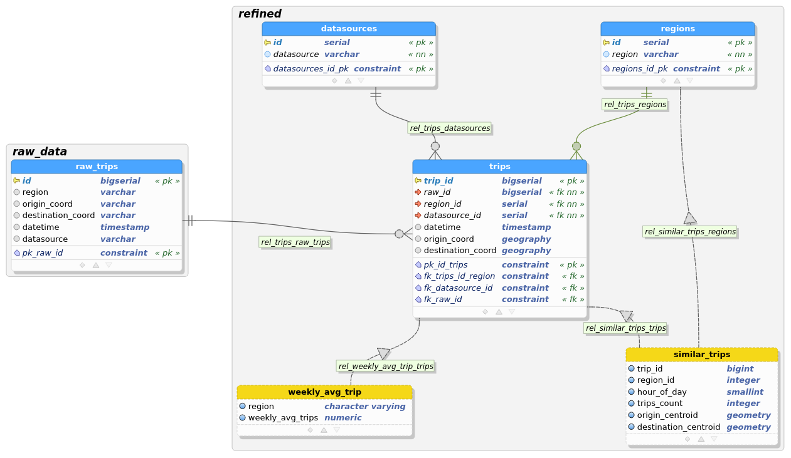
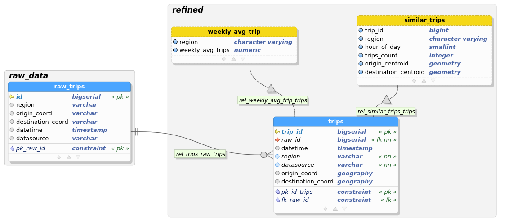
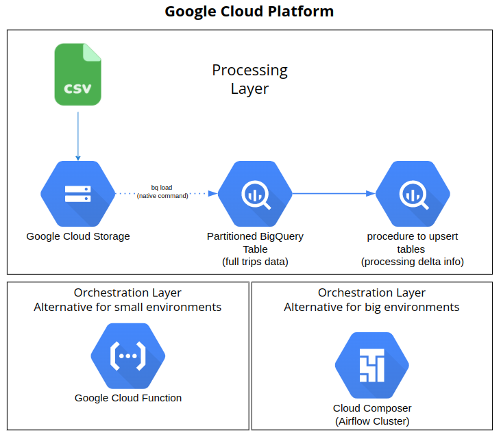

# Trips Pipeline Container
Container used to ingest CSV file to PostgreSQL environment.

## Getting Started

### Prerequisities


In order to run this container you'll need docker installed.

* [Windows](https://docs.docker.com/desktop/windows/)
* [OS X](https://docs.docker.com/desktop/mac/)
* [Linux](https://docs.docker.com/engine/install/)

Build and run these images locally:
* postgis:11-2.5-alpine
* dpage/pgadmin4

### Building and starting containerized environment
```shell
docker-compose up
```
#### Run script to import [trips.csv](https://github.com/ricardokj/trips-pipeline/blob/9dc2207846ba805cda480a5f83fe56de498c1158/input_file/trips.csv) file 
```shell
docker-compose exec postgis bash /tmp/codes/import.sh
```
#### Volumes

* `./codes/` - Code location
* `./input_file/` - File location

## Accessing pgAdmin4
* http://localhost:16543
* Login on pgAdmin4 page: postgres@gmail.com
* Password on pgAdmin4 page: postgres
* Add a new server using:
  * Hostname: postgis
  * User:postgres
  * Password:postgres

## Features
* There must be an automated process to ingest and store the data.
  *  Automated process built to import on-demand basis
* Trips with similar origin, destination, and time of day should be grouped together.
  *  Created a view, considering a 2 km radius to similar coordinates for trips at the same hour.
* Develop a way to obtain the weekly average number of trips for an area, defined by a bounding box (given by coordinates) or by a region.
  * Created a view grouped by region. The view could have a filter to select the last 12 months and to retrieve an up to date report.
* Develop a way to inform the user about the status of the data ingestion without using a polling solution.
  * Created a solution which we can only know which part of process is running (importing file or inserting on table) and the time they spent. Not able to see the real time status of each part.
* The solution should be scalable to 100 million entries. It is encouraged to simplify the data by a data model. Please add proof that the solution is scalable.
* Use a SQL database.
  * PostgreSQL used with PostGis extension.

# ERD (pgModeler)
## First Data Model
This was the first attempt to model and ingesting data. Then I got in trouble to insert data once there isn't datasource/region id inside the file and I'd have to join on a string compare. Also, the primary key on raw table plus its reference to refined table, made the performance goes down.



## No relationship
This was the last Data Model, changing from a raw layer to stage. This change saves storage, improves performance to load file and also to insert from staging table to refined one.
* The raw data won't be persisted as the first model, saving storage. 
* The primary key and reference to refined table were dropped.
* The stage table was changed to unlogged table.



## Google Cloud Platform Proposal
Those would be the ways to the set up application using Google Cloud Platform. 
Using Google Cloud Storage to store all sizes of files and BigQuery to efficiently process and store high scalable tables. The tables would be partitioned to improve performance and save costs.
For orchestration, two alternatives:
* A cheap and simple alternative to deal with few jobs scenario: Google Cloud Function triggered by Google Cloud Storage Trigger.
* An alternative to deal with many jobs with a cluster, Airflow Composer.


